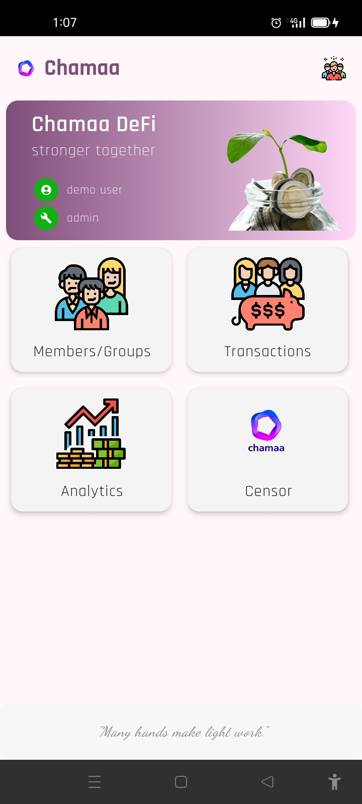
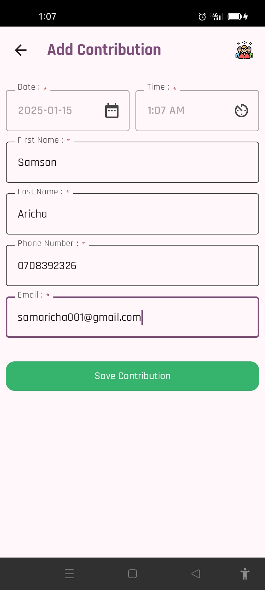
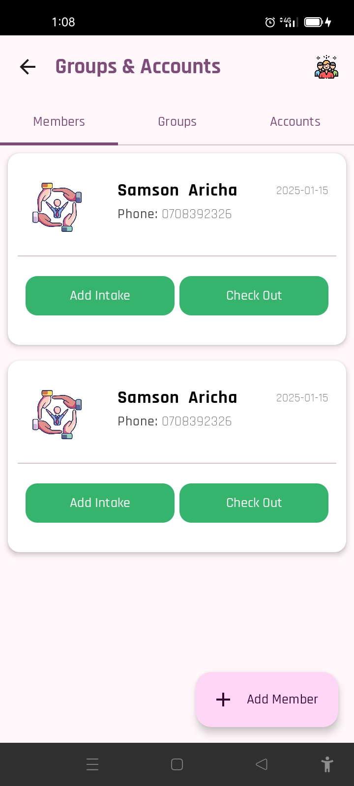
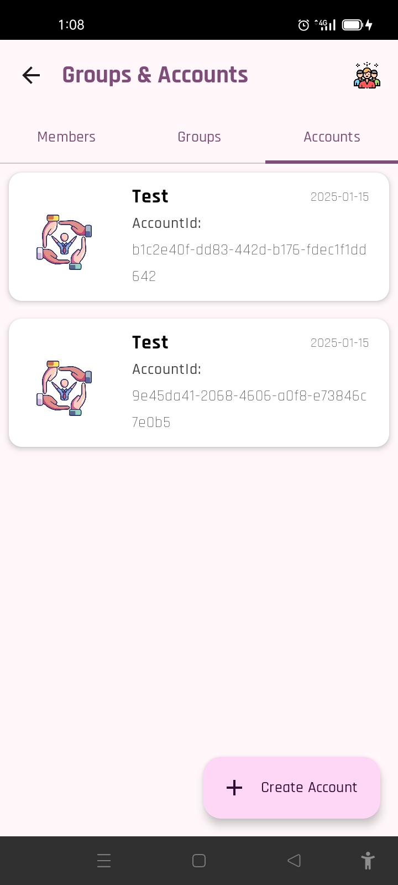
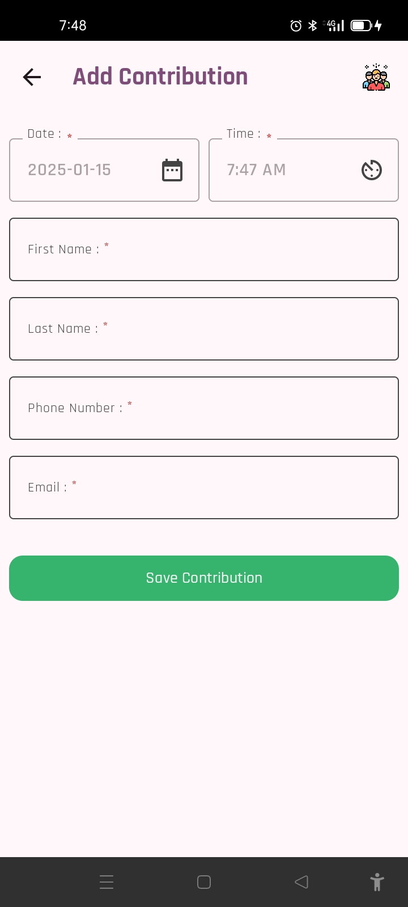

<p align="center"></p>

🌦️ Whispers of the Weather 🌤️

Step into a world where the skies tell their secrets. This weather forecast app brings you the dance of the clouds, the warmth of the sun, and the rhythm of the rain—all in real time. Powered by OpenWeatherMap's One Call API, it empowers you to:

✨ Search for the weather of distant horizons.
🌍 Unlock the forecast for your current location with a single tap.
📖 Save your favorite places in local storage, keeping their stories close for another day.

Whether you’re chasing sunshine or braving the storm, let this app be your guide to the ever-changing moods of the skies. ☁️🌈


## Key Features
1. Room for Offline Storage: The platform allows users to store and manage their savings group data offline on Android. When an internet connection is available, the data can be synced to the backend server.
2. Jetpack Compose: A modern UI toolkit for building native Android apps
3. Jetpack Navigation: A library for building navigation on Android
4. Hilt: A dependency injection library for Android
5. OpenWeatherMap API: A weather data API (One Call API) to retrieve weather data for a particular location
6. geocoder: A library for converting location coordinates to location names and vice versa
7. Google Play's Location Library: A library for retrieving the current location of the device
8. Kotlin Coroutines: A library for asynchronous programming
9. GSON: A library for serializing and deserializing JSON data

## 🛠️ Prerequisites 🛠️
#### IDE
You can either use [IntelliJ IDEA](https://www.jetbrains.com/idea/) or [Android Studio](https://developer.android.com/studio/).


# Setup Instructions

1. **Install PostgreSQL**: To save data to the database from the **Ktor Server**, you'll need to have **PostgreSQL** installed on your machine. After installation, create a database and obtain your **username** and **password**.

2. **Configure Database Connection**: Once you have your credentials, update the `Data.kt` file with your **username** and **password**. This file is located at:

3. **Create the Database**: Ensure you have a database named `chamaa` created in your PostgreSQL setup.


## Run project
To run the application on android device/emulator:
- open project and access the Application.kt file under Server Folder
- un imported android run configuration
- N:B ==> In order to run Ktor Server you will require PostgreSQL installed on your machine and have a DB named "chamaa"


## Screenshots
### Android
        


## Architecture
The app is shared between Android, Desktop with Compose Multiplatform and Server with Ktor within the same project.


## Project Structure 🏗

```
...
WeatherApp
│
|
└───app
|   |   WeatherApplication.kt
|   |
|   └───theme
|   |   |
|   |   |   Color.kt
|   |   |   Shape.kt
|   |   |   Theme.kt
|   |   |   Type.kt
|
└───core
|   |
|   └───di
|   |   |   AppModule
|   |   |   DaoModule
|   |   |   LocationModule
|   |   |   RepositoryModule
|   |   |   RoomModule
|   |   
|   └───helpers
|   |   |   EpochConverter
|   |   |   HourConverter
|   |   |   SetError
|   
└───data
|   |
|   └───datasource
|   |   |
|   |   └───local
|   |   |   |   CityLocalDataSource
|   |   |   |   ForecastLocalDataSource
|   |   |   |   MyCityLocalDataSource
|   |   |   |
|   |   |   └───db
|   |   |   |   |
|   |   |   |   └───entity
|   |   |   |   |   |   CityEntity
|   |   |   |   |   |   ForecastEntity
|   |   |   |   |   |   MyCityEntity
|   |   |   |   |
|   |   |   |   └───room
|   |   |   |   |   |   CityDao
|   |   |   |   |   |   ForecastDao
|   |   |   |   |   |   MyCityDao
|   |   |   |   |   |   WeatherDatabase
|   |   |
|   |   └───remote
|   |   |   |   ForecastRemoteDataSource
|   |   |   |
|   |   |   └───entity
|   |   |   |   |   |   CityDto
|   |   |   |   |   |   CloudinessDto
|   |   |   |   |   |   CloudsDto
|   |   |   |   |   |   CoordDto
|   |   |   |   |   |   ForecastDto
|   |   |   |   |   |   ForecastWeatherDto
|   |   |   |   |   |   MainDto
|   |   |   |   |   |   SysDto
|   |   |   |   |   |   WeatherDto
|   |   |   |   |   |   WindDto
|   |   |   |
|   |   |   └───weatherapi
|   |   |   |   |   WeatherApi
|   |
|   └───location
|   |   |   DefaultLocationTracker
|   |
|   └───mapper
|   |   |   CityDtoMapper
|   |   |   CityEntityMappper
|   |   |   ForecastDtoMapper
|   |   |   ForecastEntityMapper
|   |   |   MyCityEntityMapper
|   |
|   └───repository
|   |   |   ForecastRepositoryImpl
|   |   |   MyCityRepositoryImpl
|
└───domain
|   |
|   └───location
|   |   |   LocationTracker
|   |
|   └───mapper
|   |   |   IEntityMapper
|   |
|   └───model
|   |   |   City
|   |   |   Cloudiness
|   |   |   Clouds
|   |   |   Coord
|   |   |   Forecast
|   |   |   ForecastWeather
|   |   |   Main
|   |   |   MyCity
|   |   |   Sys
|   |   |   Weather
|   |   |   Wind
|   |
|   └───repository
|   |   |   ForecastRepository
|   |   |   MyCityRepository
|   |
|   └───usecase
|   |   |
|   |   └───forecast
|   |   |   |   AddCityToDbUseCase
|   |   |   |   AddForecastToDbUseCase
|   |   |   |   GetCityFromDbUseCase
|   |   |   |   GetForecastFromDbUseCase
|   |   |   |   GetForecastUseCase
|   |   |   |   GetForecastWithCityNameUseCase
|   |   |   |   UpdateCityDbUseCase
|   |   |   |   UpdateForecastDbUseCase
|   |   |
|   |   └───location
|   |   |   |   GetLocationUseCase
|   |   |
|   |   └───my_city
|   |   |   |   AddMyCityUseCase
|   |   |   |   DeleteMyCityUseCase
|   |   |   |   GetMyCityUseCase
|   |   |   |   GetSpecificCityUseCase
|   |   |   |   UpdateMyCityUseCase
|   |
|   └───util
|   |   |   Resource
|
└───presentation
|   |
|   └───component
|   |   |   CircularProgressBar.kt
|   |   |   CityWeatherCard.kt
|   |   |   CurrentWeatherDetailRow.kt
|   |   |   ErrorCard.kt
|   |   |   ForecastLazyRow.kt
|   |   |   ForecastTitle
|   |
|   └───home
|   |   |   HomeForecastState
|   |   |   HomeScreen.kt
|   |   |   HomeViewModel
|   |
|   └───main
|   |   |   MainActivity
|   |
|   └───navigation
|   |   |   NavGraph.kt
|   |   |   NavRoutes
|   |   |   NavScreen
|   |
|   └───search
|   |   |   MyCitiesState
|   |   |   SearchCityScreen.kt
|   |   |   SearchCityState
|   |   |   SearchCityViewModel
|
└───utils
|   |   Constants
|   |   WeatherType

```


## License
```xml
Copyright (c) 2024 Aricha Samson

    Permission is hereby granted, free of charge, to any person obtaining a copy
    of this software and associated documentation files (the "Software"), to deal
    in the Software without restriction, including without limitation the rights
    to use, copy, modify, merge, publish, distribute, sublicense, and/or sell
    copies of the Software, and to permit persons to whom the Software is
    furnished to do so, subject to the following conditions:

    The above copyright notice and this permission notice shall be included in all
    copies or substantial portions of the Software.

    THE SOFTWARE IS PROVIDED "AS IS", WITHOUT WARRANTY OF ANY KIND, EXPRESS OR
    IMPLIED, INCLUDING BUT NOT LIMITED TO THE WARRANTIES OF MERCHANTABILITY,
    FITNESS FOR A PARTICULAR PURPOSE AND NONINFRINGEMENT. IN NO EVENT SHALL THE
    AUTHORS OR COPYRIGHT HOLDERS BE LIABLE FOR ANY CLAIM, DAMAGES OR OTHER
    LIABILITY, WHETHER IN AN ACTION OF CONTRACT, TORT OR OTHERWISE, ARISING FROM,
    OUT OF OR IN CONNECTION WITH THE SOFTWARE OR THE USE OR OTHER DEALINGS IN THE
    SOFTWARE.
```  

  
