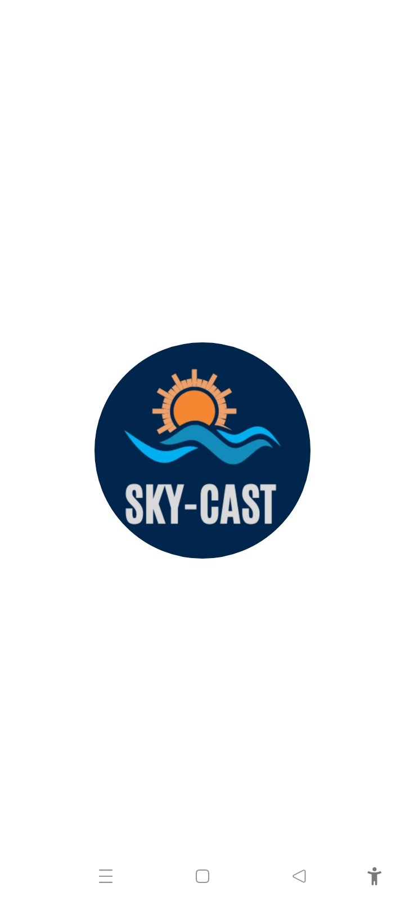
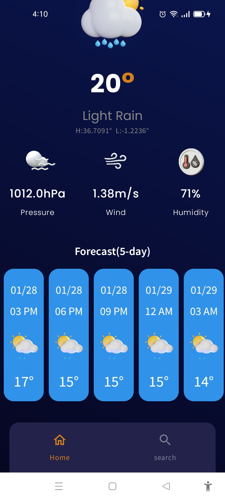
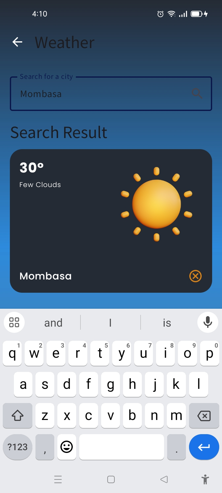
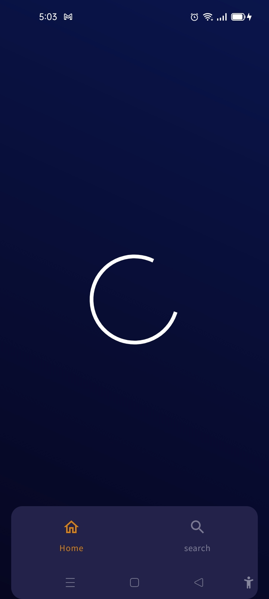
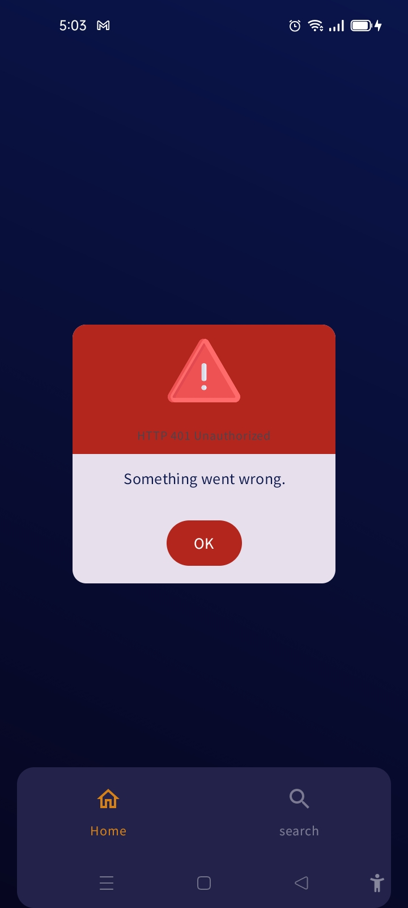

<p align="center"></p>

🌥️ SkyCast: Where Skies Speak 🌦️

Embark on a journey where the heavens reveal their tales. SkyCast lets you uncover the whispers of the clouds, the glow of the sun, and the melody of the rain—all delivered to you in real-time. With the power of OpenWeatherMap's One Call API, SkyCast enables you to:

✨ Explore the weather of faraway places and dream of horizons unknown.
📍 Unlock forecasts for your current location effortlessly.
📌 Save your cherished locations, keeping their weather stories close at hand.

Whether you're planning adventures under sunny skies or navigating through stormy weather, let SkyCast be your trusted companion for the ever-shifting moods of the atmosphere. ☀️🌈


## Key Features
1. Room for Offline Storage: The platform allows users to store and manage their savings group data offline on Android. When an internet connection is available, the data can be synced to the backend server.
2. Jetpack Compose: A modern UI toolkit for building native Android apps
3. Jetpack Navigation: A library for building navigation on Android
4. Hilt: A dependency injection library for Android
5. OpenWeatherMap API: A weather data API (One Call API) to retrieve weather data for a particular location
6. geocoder: A library for converting location coordinates to location names and vice versa
7. Google Play's Location Library: A library for retrieving the current location of the device
8. Kotlin Coroutines: A library for asynchronous programming
9. GSON: A library for serializing and deserializing JSON data

## 🛠️ Prerequisites 🛠️
#### IDE
[Android Studio](https://developer.android.com/studio/).


# Setup Instructions

1. **API KEY**: Update the API-KEY variable in Constants.kt file under utils folder i.e utils -> Constants.kt by placing your OpenWeatherMap api key in the variable.


## Run Project
To run the application on an Android device or emulator:

1. Clone the repository and open the project in Android Studio.
2. Sync the project to download all dependencies.
3. Replace the `apiKey` placeholder in the code with your OpenWeatherMap API key.
    - You can obtain an API key from [OpenWeatherMap](https://openweathermap.org/api).
4. Build and run the app on your preferred device or emulator.

> **Note:** Ensure your device/emulator has an active internet connection for retrieving weather data.


## Screenshots
### Android
        


## Architecture
The app is shared between Android, Desktop with Compose Multiplatform and Server with Ktor within the same project.


## Project Structure 🏗

```
...
WeatherApp
│
|
└───app
|   |   WeatherApplication.kt
|   |
|   └───theme
|   |   |
|   |   |   Color.kt
|   |   |   Shape.kt
|   |   |   Theme.kt
|   |   |   Type.kt
|
└───core
|   |
|   └───di
|   |   |   AppModule
|   |   |   DaoModule
|   |   |   LocationModule
|   |   |   RepositoryModule
|   |   |   RoomModule
|   |   
|   └───helpers
|   |   |   EpochConverter
|   |   |   HourConverter
|   |   |   SetError
|   
└───data
|   |
|   └───datasource
|   |   |
|   |   └───local
|   |   |   |   CityLocalDataSource
|   |   |   |   ForecastLocalDataSource
|   |   |   |   MyCityLocalDataSource
|   |   |   |
|   |   |   └───db
|   |   |   |   |
|   |   |   |   └───entity
|   |   |   |   |   |   CityEntity
|   |   |   |   |   |   ForecastEntity
|   |   |   |   |   |   MyCityEntity
|   |   |   |   |
|   |   |   |   └───room
|   |   |   |   |   |   CityDao
|   |   |   |   |   |   ForecastDao
|   |   |   |   |   |   MyCityDao
|   |   |   |   |   |   WeatherDatabase
|   |   |
|   |   └───remote
|   |   |   |   ForecastRemoteDataSource
|   |   |   |
|   |   |   └───entity
|   |   |   |   |   |   CityDto
|   |   |   |   |   |   CloudinessDto
|   |   |   |   |   |   CloudsDto
|   |   |   |   |   |   CoordDto
|   |   |   |   |   |   ForecastDto
|   |   |   |   |   |   ForecastWeatherDto
|   |   |   |   |   |   MainDto
|   |   |   |   |   |   SysDto
|   |   |   |   |   |   WeatherDto
|   |   |   |   |   |   WindDto
|   |   |   |
|   |   |   └───weatherapi
|   |   |   |   |   WeatherApi
|   |
|   └───location
|   |   |   DefaultLocationTracker
|   |
|   └───mapper
|   |   |   CityDtoMapper
|   |   |   CityEntityMappper
|   |   |   ForecastDtoMapper
|   |   |   ForecastEntityMapper
|   |   |   MyCityEntityMapper
|   |
|   └───repository
|   |   |   ForecastRepositoryImpl
|   |   |   MyCityRepositoryImpl
|
└───domain
|   |
|   └───location
|   |   |   LocationTracker
|   |
|   └───mapper
|   |   |   IEntityMapper
|   |
|   └───model
|   |   |   City
|   |   |   Cloudiness
|   |   |   Clouds
|   |   |   Coord
|   |   |   Forecast
|   |   |   ForecastWeather
|   |   |   Main
|   |   |   MyCity
|   |   |   Sys
|   |   |   Weather
|   |   |   Wind
|   |
|   └───repository
|   |   |   ForecastRepository
|   |   |   MyCityRepository
|   |
|   └───usecase
|   |   |
|   |   └───forecast
|   |   |   |   AddCityToDbUseCase
|   |   |   |   AddForecastToDbUseCase
|   |   |   |   GetCityFromDbUseCase
|   |   |   |   GetForecastFromDbUseCase
|   |   |   |   GetForecastUseCase
|   |   |   |   GetForecastWithCityNameUseCase
|   |   |   |   UpdateCityDbUseCase
|   |   |   |   UpdateForecastDbUseCase
|   |   |
|   |   └───location
|   |   |   |   GetLocationUseCase
|   |   |
|   |   └───my_city
|   |   |   |   AddMyCityUseCase
|   |   |   |   DeleteMyCityUseCase
|   |   |   |   GetMyCityUseCase
|   |   |   |   GetSpecificCityUseCase
|   |   |   |   UpdateMyCityUseCase
|   |
|   └───util
|   |   |   Resource
|
└───presentation
|   |
|   └───component
|   |   |   CircularProgressBar.kt
|   |   |   CityWeatherCard.kt
|   |   |   CurrentWeatherDetailRow.kt
|   |   |   ErrorCard.kt
|   |   |   ForecastLazyRow.kt
|   |   |   ForecastTitle
|   |
|   └───home
|   |   |   HomeForecastState
|   |   |   HomeScreen.kt
|   |   |   HomeViewModel
|   |
|   └───main
|   |   |   MainActivity
|   |
|   └───navigation
|   |   |   NavGraph.kt
|   |   |   NavRoutes
|   |   |   NavScreen
|   |
|   └───search
|   |   |   MyCitiesState
|   |   |   SearchCityScreen.kt
|   |   |   SearchCityState
|   |   |   SearchCityViewModel
|
└───utils
|   |   Constants
|   |   WeatherType

```


## License
```xml
Copyright (c) 2024 Aricha Samson

    Permission is hereby granted, free of charge, to any person obtaining a copy
    of this software and associated documentation files (the "Software"), to deal
    in the Software without restriction, including without limitation the rights
    to use, copy, modify, merge, publish, distribute, sublicense, and/or sell
    copies of the Software, and to permit persons to whom the Software is
    furnished to do so, subject to the following conditions:

    The above copyright notice and this permission notice shall be included in all
    copies or substantial portions of the Software.

    THE SOFTWARE IS PROVIDED "AS IS", WITHOUT WARRANTY OF ANY KIND, EXPRESS OR
    IMPLIED, INCLUDING BUT NOT LIMITED TO THE WARRANTIES OF MERCHANTABILITY,
    FITNESS FOR A PARTICULAR PURPOSE AND NONINFRINGEMENT. IN NO EVENT SHALL THE
    AUTHORS OR COPYRIGHT HOLDERS BE LIABLE FOR ANY CLAIM, DAMAGES OR OTHER
    LIABILITY, WHETHER IN AN ACTION OF CONTRACT, TORT OR OTHERWISE, ARISING FROM,
    OUT OF OR IN CONNECTION WITH THE SOFTWARE OR THE USE OR OTHER DEALINGS IN THE
    SOFTWARE.
```  

  
